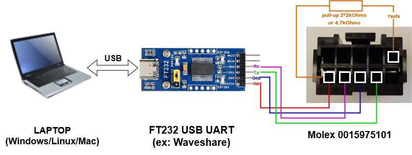

# TeslaMS1_BMS_SerialTool

This tool is a *Python* GUI for communicating with a worker/slave module from the BMS of the **Tesla Model S** mk1 (2012-2016) via a USB-to-UART converter. Its goal is to enhance the BMS reparability and extend its usability for diverse applications.<br>

**Features:**
- Slave reset
- ID config
- Voltage thresholds config
- Temperature thresholds config
- Cells voltages reading
- Temperatures reading
- Alerts and faults reading
<br><br>


# Disclaimer

The tool from this Github has been tested and should not deteriorate any electronic material nor harm the user.<br>
However, be conscientious settings things up. Keep in mind that you are working on a battery system.<br>
The author of this Github is not responsible for any deterioration or injury.
<br><br>

# Getting Started

## Hardware setup

The picture below shows the **Tesla Model S** mk1 (2012-2016) slave **BMS** for which the present tool is made for.
We will communicate with it through the female connector available on its PCB and highlighted on the following picture:


This female connector is compatible with the male connector **Molex 0015975101**:<br>
https://www.molex.com/en-us/products/part-detail/15975101

In this Getting Started section, we will use a laptop to communicate with the slave BMS.<br>
To setup the cable connecting your laptop to the slave BMS, we will convert the USB from your laptop to UART thanks to a FT232 USB-to-UART board and use the **Molex 0015975101** male connector to plug the UART side on the slave board. The connections are detailed in the following schematic:

**Warning:** 
- If the BMS slave board you want to communicate with is disconnected from any other slave, you can set up the FT232 USB-to-UART board to either 3.3V or 5V. This is because the Si8642 Isolator used on the slave BMS can accept both voltages on its bus interface. If your slave BMS board is already receiving an external voltage on its Molex connector, use the same voltage as already present.
- Note that in the schematic below, the Molex connector is seen from the side where you insert the wires (not the side going into the PCB female connector).
<br><br>



Once you have setup such a cable, you can plug the USB side to your PC and the Molex side to the slave BMS before following the "**Running the tool**" section to start interacting with your target.

**TODO**<br>
If you don't have a Molex 0015975101 connector at end, you can also directly solder wires to the PCB to get something looking like this:<br>
**TODO**

## Running the tool

Run the commands below in a shell to get the tool application running in a Python virtual environment.

```bash
# Create a venv named 'tms_bms_venv' (or whatever you prefer)
python -m venv tms_bms_venv

# Activate this venv
# On Linux/macOS:
source tms_bms_venv/bin/activate
# On Windows:
tms_bms_venv\Scripts\activate

# Install requirements.txt
pip install -r requirements.txt

# Run the application
python src/main.py

# At any moment, you can deactivate the venv and get back to your global Python environment with
deactivate
```


# TODO

## Misc
- Add warning on responsibility if any issues
- Add instructions if no molex
- Add a list of features in README
- Write doc on logging
- Refactor for Python uv
- Mention sources
- Add a markdown file for extra information
- lint
- contribute.md
- Commentaries
- Add things to clarify (toggling UV OV alerts)

## Features
- Add a full update button
- Add reading and displaying of DEVICE_STATUS register
- Add setting of voltage and temperature threshold comparison timings
- Display the information when security thresholds are disabled