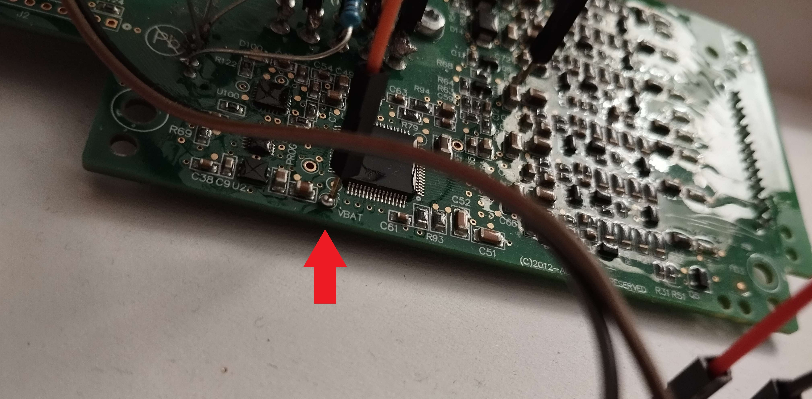
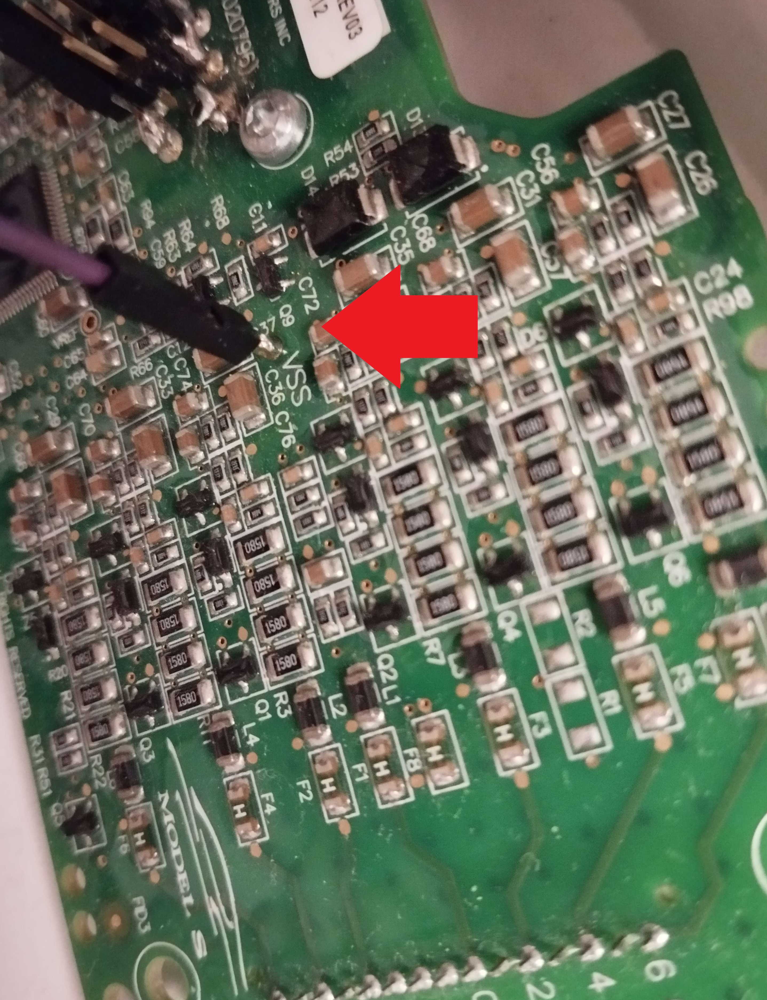
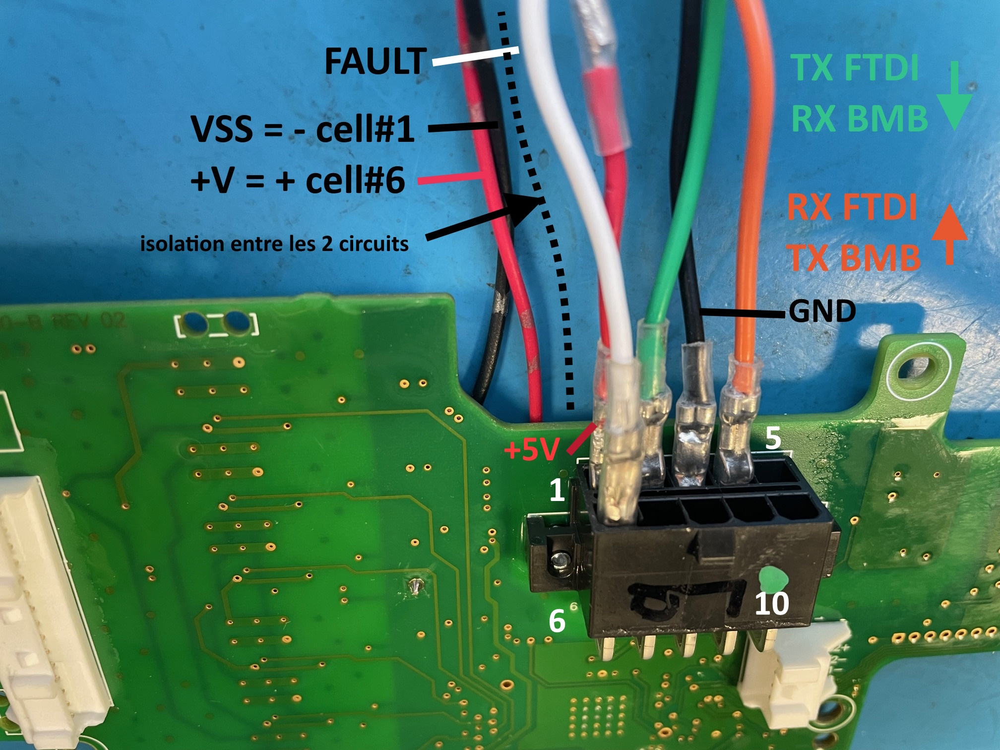
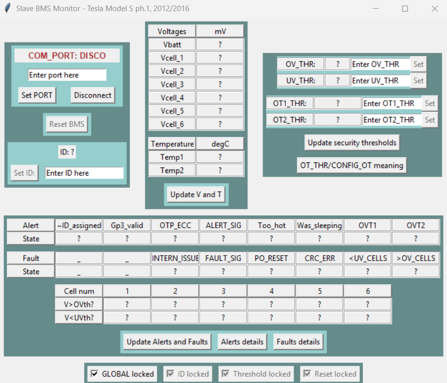

# TeslaMS1_BMS_SerialTool

This tool is a **Python** Graphical User Interface (GUI) to communicate with a slave module from the **Battery Management System (BMS)** of the **Tesla Model S** mk1 (2012-2016).<br>
The communication is done through the module UART port (e.g: with a USB-to-UART converter).<br>
This tool's goal is to enhance the BMS reparability and extend its usability for diverse applications (energy storage, off-road vehicles...).<br>

**Features:**
- Slave reset (BQ76 BMS chip parameters back to default)
- Slave ID reading and configuration
- Cells voltages reading
- Temperatures reading
- Over and under voltage thresholds reading and configuration
- Over temperature thresholds reading and configuration
- Alerts and faults reading
- Alerts and faults clearing
- Slave data file logging mechanism (in case a rollback is needed)
- Functions to read and write registers from the TI BQ76 BMS chip
<br><br>


# Disclaimer

This tool has been tested and is not intended to cause damage to electronic components or harm users.<br>
However, working with battery management systems (BMS) involves risks, including potential damage to hardware and personal injury.<br>
Use this tool at your own risk. The author assumes no responsibility for any damage, injury, or other consequences resulting from its use. Always follow proper safety precautions when working with battery systems.
<br><br>

# Hardware setup

The picture below shows the PCB of the **Tesla Model S** mk1 (2012-2016) slave **BMS** for which the present tool is made for. In the litterature, we can also find the name **BMB** (Battery Management Board).
We will communicate with it through the female connector available on its PCB, exposing a UART port, and highlighted by a red arrow on the following picture:<br>


*PCB serial com entry point*<br>

This female connector is compatible with the male connector **Molex 0015975101**:<br>
https://www.molex.com/en-us/products/part-detail/15975101

In this documentation, we will use a laptop to communicate with one slave BMS.<br>
In the following sections, we describe:
- How to simulate the temperature sensors if they are no more connected to the board (through the J6 labelled connector on the PCB),
- How to simulate the 6 cells to monitor if they are no more connected to the board (through the J3 labelled connector on the PCB),
- Two methods to connect your laptop to the slave BMS: one that requires the **Molex 0015975101** male connector, and one "DIY" that requires soldering and wiring.
<br>

Note that there are other methods to communicate with the slave BMS UART port. For example, it could be done with the UART port of an Arduino board instead of using a laptop and a USB-to-UART adapter.<br>

## Temperature sensors simulation

**Note:**
This section gives a solution to simulate the 2 temperature sensors from the BMS slave board in case none are connected to the J6 connector of the board under test.<br>

One of the roles of the BMS slave board, when still in a Tesla Model S, is to measure two temperatures on the 6-packed cells it is monitoring.<br>
This measurement is done thanks to two temperature sensors plugged into the J6 connector (TS1+, TS2+, TS2-, TS1-) highlighted by the red arrow in the picture below:<br>


*Temperature sensors location*<br>

According to the main inspiration source of the present Github project (this [Hackaday post](https://hackaday.io/project/10098/logs)), a candidate for the temperature sensors is a 10k Ohms NTC (Negative Temperature Coefficient) such as the **ERT-J1VG103FA**. For this NTC, a value of 10k Ohms corresponds to a measurement of 25°C.<br>
So as to measure a known and plausible temparature (25°C), the slave board "under test" used to write this documentation has two 10k Ohms resistors soldered on its J6 connector. See the picture below for illustration (10k Ohm between TS1+ and TS1-, same thing between TS2+ and TS2-):<br>


*10k Ohms as temperature sensors*<br>

With those two resistors, when monitoring the temperatures read by your BMS slave board with the present tool, you should get something near 25°C.<br><br>

## Cells voltage simulation

**Note:**
This section gives a solution to simulate the 6 cells, supposed to be monitored by the BMS slave board, in case none are connected to the J3 connector of the board under test.<br>

Another role for the BMS slave board is to read the voltage of 6 cells connected to its J3 connector (see the left white connector on the [Temperature sensors location](img/temp_sensors_loc.png) picture).<br>
Once connected to J3, those cells are in series. This means that their voltage are added.<br>
On the PCB, the total cells voltage is annotated Vbatt for the positive potential, and Vss for the negative one. It is used to power the "cells monitoring" part of the slave board (mainly the TI BQ76 chip) and is different from the voltage coming from the Molex connector and powering the UART bus side of the slave board.<br>
Because it corresponds to 6 Tesla Model S 18650 cells, this total voltage has a nominal value of 6x3.7=22.2V, minimal value of 6x2.5=15V and maximum value of 6*4.2V=25.2V.<br><br>
For the development of the tool presented here, no cell was at disposition. To simulate the cells, the work-around exploited consists in powering Vbatt-Vss with an external power source.

A Vbatt test point can be found here:<br>


*Vbatt location*
<br>

And a Vss test point here:<br>


*Vss location*
<br>

Applying an externally generated 12V on Vbatt, and its GND reference on Vss allows to power the monitoring side of the slave board. To totally power the board and make it boot, you need to power both this monitoring side through Vbatt-Vss, and the UART/communication side through Vcc-GND pins of the Molex female connector detailed in another section.<br>

**Warnings:**<br>
Note that 12V is under the theoretical minimal 6x18650-cells voltage (12V<15V). But the TI BQ76 BMS chip datasheet announces that it can be powered with a voltage down to 7.2V. Thus, there should be no problem with a 12V power supply for the cells part of the board.<br><br>

## Laptop connection

### Molex connector method (method 1/2)

To setup the cable connecting your laptop to the slave BMS, we will convert the USB from your laptop to UART thanks to a FT232 USB-to-UART board and use the **Molex 0015975101** male connector to plug the FT232 UART side on the slave board. The connections are detailed in the following schematic and picture:

**Warnings:** 
- If the BMS slave board you want to communicate with is disconnected from any other slave, you can set up the FT232 USB-to-UART board to either 3.3V or 5V. This is because the Si8642 Isolator used on the slave BMS can accept both voltages on its bus interface. If your slave BMS board is already receiving an external voltage on its Molex connector, use the same voltage as already present.
- Note that in the schematic below, the Molex connector is seen from the side where you insert the wires (not the side going into the PCB female connector).
- Do not forget the pull-up resistor between the Faults line and Vcc (faults are considered when the Faults line is grounded).
<br><br>


*PC-BMS cable schematic*
<br>


*Molex pinout picture (BMB = Battery Management Board)*
<br>

By comparing the two previous images, you can see that there is two possible positions for Vcc (annotated +5V on the second image, but it can also be 3.3V as described in the previous Warnings list). It can be either next to TX_FTDI or RX_FTDI.<br><br>
Once you have setup such a cable, and potentially the temperature sensors and cells simulators, you can plug the USB side to your PC and the Molex side to the slave BMS before following the "**Running the tool**" section to start interacting with your target (the BMS slave board).<br>

**Note**:<br>
To start and boot, the slave board requires both of its side to be powered:
- Its UART/communication side, that is the Vcc-GND pins of the Molex female connector,
- And its cells monitoring side, that is the Vbatt-Vss voltage from its J6 connector.
<br><br>

### DIY connector method (method 2/2)

If you don't have a **Molex 0015975101** as required in the previous method, you can also directly solder wires to the slave module PCB so as to power it and expose its UART port. This section suggests a way to do this.<br>

**Note:** Excuse the quality of the setup and the solderings. The equipment available was limited.<br>

The pins of the Molex female connector we want to get access to are:
- Vcc
- GND
- UART_TX
- UART_RX
- Faults line

By respecting the same pinout as shown in the two images from the first method ([PC-BMS cable schematic](img/teslams_bms_serial_cable.drawio.png) and [Molex pinout picture](img/molex_pinout.jpg)), the first thing to do is to solder wires or male pins on the basis of the Molex female connector of the slave module PCB.<br>

A way to do this is illustrated by the pictures below:<br>

")
*DIY Molex header (view 1)*
")
*DIY Molex header (view 2)*
<br>

On those illustrations, the color code for the wires gathered on the Molex zone (near the two screws) is:
- Orange 1 (on the same row than White, Grey and Yellow): **Vcc**
- White: **RX_FT232** / **TX_BMS**
- Grey: **GND**
- Yellow: **TX_FT232** / **RX_BMS**
- Orange 2 (alone on its row): **Faults line**<br>

FT232 is the name of the USB-to-UART converter board used for this documentation.

Finally, you should get the same signal/power placement than in the right side of this schematic from the first method. Note that the color code is not the same than on the previous pictures.<br>


*PC-BMS cable schematic*
<br>

Once the pins of the Molex female connector of your slave board are accessible, you can connect this board to a laptop through a USB-to-UART converter by following the schematic above.<br>

The same **warnings** as for the first method are still valid:
- If the BMS slave board you want to communicate with is disconnected from any other slave, you can set up the FT232 USB-to-UART board to either 3.3V or 5V. This is because the Si8642 Isolator used on the slave BMS can accept both voltages on its bus interface. If your slave BMS board is already receiving an external voltage on its Molex connector, use the same voltage as already present.
- Do not forget the pull-up resistor between the Faults line and Vcc (faults are considered when the Faults line is grounded).<br>

Once you have finished this setup, you can follow the "**Running the tool**" section to start interacting with your target.<br>

**Note**:<br>
To start and boot, the slave board requires both of its side to be powered:
- Its UART/communication side, that is the Vcc-GND pins of the Molex female connector,
- And its cells monitoring side, that is the Vbatt-Vss voltage from its J6 connector.
<br><br>


# Running the tool

Run the commands below in a shell to get the tool application running in a Python virtual environment. You can skip the virtual environment related commands (start at `pip install -r requirements.txt`) if you don't want to use one.

```bash
# Create a venv named '.venv' (or whatever you prefer)
python -m venv .venv

# Activate this venv
# In a Linux/macOS Terminal:
source .venv/bin/activate
# In a Windows Powershell:
.venv\Scripts\activate

# Install requirements.txt
pip install -r requirements.txt

# Run the application
python src/main.py

# At any moment, you can deactivate the venv and get back to your global Python environment with
deactivate
```

If the launch is successful, you should get a window looking like this:<br>


*Tool initial screen*

The functions for each button and text box are rather self-explanatory. Although, a documentation for the graphic interface should be added soon to this repo.<br><br>

# Logging

The tool includes a logging mechanism.<br>

Each time it is launched, it is creating a log file to store information read from the inspected board. The goal is to be able to record the evolution of the board and rollback its state if needed.<br>
This log file is generated in an automatically created **log** folder located in the root folder of the tool repo.<br>
The default name of the log file is: *log_%Y%m%d_%H%M%S.txt*. It ends with a date and time timestamp to make it unique.<br>
The logged information corresponds to full memory dumps from the TI BQ76 BMS chip of the board. The meaning of each memory address, the registers, is detailed at the page 38 / table 5 of its [datasheet](https://www.ti.com/lit/ds/symlink/bq76pl536a-q1.pdf?ts=1705751391108&ref_url=https%253A%252F%252Fwww.ti.com%252Fproduct%252FBQ76PL536A-Q1).<br>

The full memory dump logging is done at each of the following event:
- When connecting to a board,
- When reseting a board,
- When updating the ID of the board,
- When updating the over-voltage threshold,
- When updating the under-voltage threshold,
- When updating the over-temperature threshold #1,
- When updating the over-temperature threshold #2.

Below is an example of a logged memory dump:
```bash
2024-03-02 21:42:06,350 - gui - INFO - Connection to COM6, memory dump: @0:0x80 @1:0x0  @2:0x4c @3:0x61 @4:0x0  @5:0x0  @6:0x0  @7:0x0  @8:0x0  @9:0x0  @10:0x0  @11:0x0  @12:0x0  @13:0x0  @14:0x0  @15:0x0  @16:0x0  @17:0x0  @18:0x0  @19:0x0  @20:0x0  @21:0x0  @22:0x0  @23:0x0  @24:0x0  @25:0x0  @26:0x0  @27:0x0  @28:0x0  @29:0x0  @30:0x0  @31:0x0  @32:0x0  @33:0x0  @34:0x0  @35:0x80 @36:0xb  @37:0x30 @38:0xf  @39:0x0  @40:0x0  @41:0x0  @42:0x0  @43:0x0  @44:0x0  @45:0x0  @46:0x0  @47:0x0  @48:0x0  @49:0x0  @50:0x0  @51:0x0  @52:0x0  @53:0x0  @54:0x0  @55:0x0  @56:0x0  @57:0x0  @58:0x0  @59:0x0  @60:0x0  @61:0x0  @62:0x0  @63:0x0  @64:0x0  @65:0x0  @66:0x0  @67:0x10 @68:0x80 @69:0x31 @70:0x81 @71:0x8  @72:0x81 @73:0x66 @74:0xff @75:0x15 @76:0x0  @77:0x0  @78:0x0  @79:0x9b 
```
<br>

# Still to investigate

## OV/UV flags glitches

When testing the tool, it has happened to observe unexpected raised Over-Voltage (OV) and Under-Voltage (UV) flags when connecting to a slave board isolated from the other boards of its former Tesla battery pack, and powered for the first time. Note that no real cell was connected to the cells part of the board when doing this observation, only Vbatt-Vss was directly provided through an external power supply (12V). Also, when maintaining power and reseting the board thanks to the present tool, no undexpected flag is raised anymore.<br><br>
Finally, this observation might be due to the fact that the board has been disconnected from its former cell-pack and connected to another type of power supply (cell vs. voltage regulator). Moreover, powering the board directly through Vbatt-Vss makes it functional but all the intermediary cell voltage points visible on the board are let empty. It will be interesting to investigate deeper this glitch in the future.
<br><br>

# Contributing

This repo is open to contribution (of course). Do not hesitate to comment or submit your pull/merge requests. You can also directly contact me at *adam.santamaria@outlook.fr* for any inquiries.
Please lint the modified code with black before submitting.
<br><br>

# Sources

- [Hackaday](https://hackaday.io/project/10098/logs) post from [Jarod](https://hackaday.io/jrock)
- https://github.com/collin80/TeslaBMS
- https://github.com/Tom-evnut
- https://repositorio-aberto.up.pt/bitstream/10216/119326/2/320725.pdf
<br><br>

# TODO

## Misc
- Document the Graphic Interface further (button, items purpose etc..)
- Clarify/solve the points in the "Still to investigate" section
- Testing the tool by applying Vbatt-Vss=22V (nominal voltage for 6x 18650 cells) instead of 12V
- Clean the code linting warnings raised by flake8 and pylint
- Improve and complete code comments (e.g: docstring for classes and functions)
- Add support for Python uv

## Features
- Add a full update button
- Add reading and displaying of DEVICE_STATUS register
- Add setting of voltage and temperature threshold comparison timings
- Display the information when security thresholds are disabled